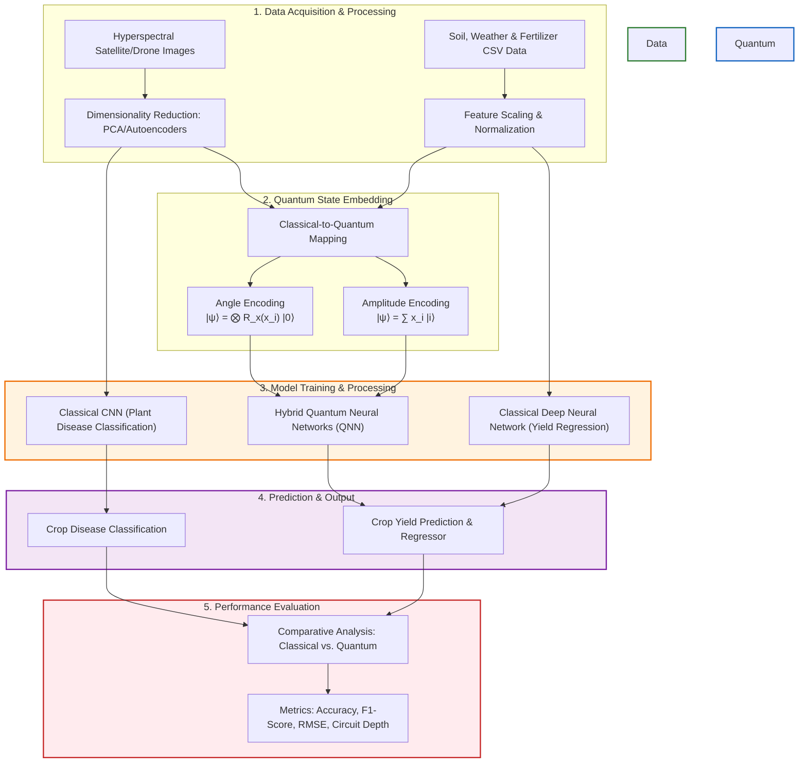

# 🌾 Crop Disease & Yield Prediction: Classical and Quantum ML Integration

> **Research Codebase** | **Course: MCS206P**
>
> A hybrid paradigm leveraging classical Deep Learning (CNNs, Random Forests) and State-of-the-Art Quantum Machine Learning (QML) techniques (QSVM, QNN) to address precision agriculture bottlenecks in high-dimensional hyperspectral image processing and crop yield forecasting.

---

## 📊 Table of Contents
- [📖 Abstract](#-abstract)
- [🏷️ Keywords](#️-keywords)
- [🏛️ Section 1: Introduction](#️-section-1-introduction)
  - [The Precision Agriculture Bottleneck](#the-precision-agriculture-bottleneck)
  - [The Quantum Paradigm Shift (QML)](#the-quantum-paradigm-shift-qml)
- [🎯 Section 3: Problem Formulation](#-section-3-problem-formulation)
  - [3.1 Problem Description](#31-problem-description)
  - [3.2 Problem Statement](#32-problem-statement)
  - [3.3 Objectives](#33-objectives)
- [🔄 Pipeline Architecture](#-pipeline-architecture)
- [📂 Project & Dataset Structure](#-project--dataset-structure)
- [⚙️ Installation & Workspace Setup](#️-installation--workspace-setup)
  - [1. Quick Setup via `uv` (Recommended)](#1-quick-setup-via-uv-recommended)
  - [2. Fallback Setup via `pip`](#2-fallback-setup-via-pip)
- [🚀 Quick Start & Environment Verification](#-quick-start--environment-verification)

---

## 📖 Abstract

Optimizing Crop Disease and Yield Prediction Using ML and Quantum Machine Learning Techniques is essential in addressing the growing challenges faced by modern agriculture, including climate variability, increasing incidence of plant diseases, and the rising demand for global food security. Traditional agricultural practices, followed by classical machine learning methods, have contributed significantly to crop monitoring, disease detection, and yield estimation. However, these approaches often struggle with processing high-dimensional, large-scale, and multimodal datasets such as satellite imagery, weather data, and soil parameters, leading to limitations in accuracy, scalability, and computational efficiency. 

To overcome these challenges, this study explores the application of **Quantum Machine Learning (QML)** techniques, including **Quantum Support Vector Machines (QSVM)**, **Quantum Neural Networks (QNN)**, and hybrid quantum-classical models. By leveraging the principles of quantum computing—such as superposition and entanglement—QML provides enhanced capabilities for handling complex data patterns and nonlinear relationships inherent in agricultural datasets. 

The approach involves:
1. **Data Collection & Preprocessing:** Processing multimodal agricultural and hyperspectral datasets.
2. **Quantum State Encoding:** Mapping classical features into quantum states (amplitude/angle encoding).
3. **Hybrid Model Training:** Training parameterized quantum circuits (PQCs) and quantum kernels for classification and regression.
4. **Performance Evaluation:** Benchmarking QML models against state-of-the-art traditional machine learning methods.

Simulations indicate that QML models can achieve improved prediction accuracy, better scalability, and more efficient handling of complex datasets compared to classical approaches.

---

## 🏷️ Keywords
`Crop Disease Monitoring` • `Crop Yield Prediction` • `Hyperspectral Image Analysis` • `Quantum Machine Learning (QML)` • `Hybrid Models`

---

## 🏛️ Section 1: Introduction

Agriculture remains a cornerstone of global food security, sustaining billions of people and contributing significantly to economic development worldwide. However, the sector is increasingly challenged by a combination of climate change, biodiversity loss, soil degradation, and the rapid spread of plant diseases [5]. Among these, crop diseases alone are responsible for an estimated **10–40% reduction** in global agricultural yield, leading to substantial economic losses and threatening the stability of global food systems [6]. These challenges are further intensified by the growing global population and the urgent need to increase agricultural productivity in a sustainable manner [6].

### The Precision Agriculture Bottleneck
In recent years, traditional machine learning (ML) techniques—such as **Convolutional Neural Networks (CNNs)**, **Support Vector Machines (SVMs)**, and ensemble methods like **Random Forests**—have demonstrated significant success in agricultural applications [1]. These include:
- Crop disease detection through image classification
- Yield prediction using historical and environmental data
- Decision support systems for farmers [12]

Despite these advancements, classical ML approaches often struggle when dealing with high-dimensional, heterogeneous, and multimodal datasets [12]. Modern agricultural data sources, including hyperspectral satellite imagery, drone-based sensing, and Internet of Things (IoT) sensor networks, generate vast and complex datasets that pose computational and scalability challenges for classical algorithms [11].

### The Quantum Paradigm Shift (QML)
**Quantum Machine Learning (QML)** emerges as a promising paradigm to overcome these limitations by leveraging principles of quantum computing, such as **superposition**, **entanglement**, and **quantum parallelism** [11]. These properties enable quantum systems to represent and process information in fundamentally different ways compared to classical systems, potentially offering exponential speedups and enhanced pattern recognition capabilities for certain classes of problems [12].

```
                     CLASSICAL SYSTEM                   QUANTUM SYSTEM
               ┌───────────────────────────┐     ┌───────────────────────────┐
               │    Deterministic Bits     │     │      Quantum Qubits       │
   State:      │         [ 0 / 1 ]         │     │  |ψ⟩ = α|0⟩ + β|1⟩        │
               └─────────────┬─────────────┘     └─────────────┬─────────────┘
                             │                                 │
                             ▼                                 ▼
               ┌───────────────────────────┐     ┌───────────────────────────┐
   Properties: │  Sequential Processing    │     │ Superposition,            │
               │  Linear Vector Space      │     │ Entanglement, Parallelism │
               └───────────────────────────┘     └───────────────────────────┘
```

In the context of agriculture, QML can be particularly advantageous for analyzing high-dimensional data, capturing complex correlations, and improving model generalization [11]. This paper explores the application of QML techniques, with a focus on:
1. **Quantum Support Vector Machines (QSVM):** QSVM leverages quantum kernel methods to enhance classification performance in complex, highly non-linear feature spaces [17].
2. **Quantum Neural Networks (QNN):** QNN models utilize parameterized quantum circuits (PQCs) to learn intricate patterns in agricultural data [17].

By integrating these approaches into precision agriculture frameworks, it becomes possible to develop more accurate, efficient, and scalable solutions [18]. Furthermore, the adoption of QML in agriculture has the potential to revolutionize decision-making processes by enabling real-time analysis of diverse data streams, optimizing the use of resources such as water, fertilizers, and pesticides, and reducing environmental impact [22]. This integration aligns with the broader goals of sustainable agriculture and smart farming, contributing to improved productivity, resilience, and ecological balance [27].

---

## 🎯 Section 3: Problem Formulation

### 3.1 Problem Description
Crop disease monitoring and yield prediction are critical for ensuring food security and sustainable agriculture. Traditional machine learning models, such as CNNs and Random Forests, have achieved notable success in disease classification and yield estimation. However, they face three major challenges:

1. **High-dimensional hyperspectral data:** Classical ML struggles to efficiently process hyperspectral imagery, which contains hundreds of spectral bands per pixel, often suffering from the *curse of dimensionality*.
2. **Computational bottlenecks:** Large-scale agricultural datasets demand high computational resources, limiting scalability and real-time application.
3. **Early detection limitations:** Subtle disease symptoms in hyperspectral images often go undetected by classical ML in their early stages, delaying critical intervention.

### 3.2 Problem Statement
> **Despite advances in classical ML, current approaches fail to fully exploit the rich information embedded in hyperspectral agricultural datasets. This leads to delayed disease detection and inaccurate yield forecasting, which negatively impacts crop management and food security. There is a pressing need to design QML-based frameworks that optimize disease monitoring and yield prediction by harnessing quantum computational advantages.**

### 3.3 Objectives
* 🎯 **Objective 1:** To develop ML and QML models (e.g., QSVM, QNN) tailored for hyperspectral crop disease detection.
* 🎯 **Objective 2:** To integrate hybrid ML and QML-classical regression pipelines for accurate yield prediction.

---

## 🔄 Pipeline Architecture

The following diagram illustrates the hybrid classical-quantum framework proposed for processing hyperspectral image bands and environmental datasets:



---

## 📂 Project & Dataset Structure

```
├── .python-version          # Lock file specifying Python version (>=3.12)
├── pyproject.toml           # Modern PEP 518/621 project configurations and dependencies
├── uv.lock                  # Lock file ensuring deterministic environment resolution
├── README.md                # Project documentation & abstract details
├── main.py                  # Project entry point and environment sanity check
├── exploration.ipynb        # Jupyter Notebook containing data exploratory cells
│
├── 🌿 Pipeline 1: Plant Disease Classification (Image Data)
│   ├── plant_classifier.ipynb        # CNN Model Evaluation & Visualization
│   ├── train_plant_classifier.py     # Classical CNN Training Script
│   └── plantvillage dataset/         # Primary Dataset: Image library divided into 38 disease categories
│       ├── Apple___Apple_scab/
│       ├── Apple___Black_rot/
│       ├── Apple___healthy/
│       ├── Tomato___Bacterial_spot/
│       └── ... (38 subdirectories in total)
│
└── 🌾 Pipeline 2: Crop Yield Prediction (Tabular Data)
    ├── crop_yield.csv                # Secondary Dataset: Multimodal historical environmental & yield records
    │
    ├── Classical Models:
    │   ├── crop_yield_nn.ipynb       # Classical Baseline Neural Network Evaluation
    │   └── train_nn_crop_yield.py    # Classical Baseline Training Script
    │
    └── Quantum-Classical Hybrid Models:
        ├── train_qnn_crop_yield.py           # Hybrid QNN Training (End-to-End & Feature Extraction)
        ├── train_qnn_large_head_crop_yield.py# Large Classical Head Fine-tuning on Quantum Features
        ├── qnn_crop_yield_small.ipynb        # Lightweight End-to-End Hybrid QNN Evaluation
        └── qnn_crop_yield.ipynb              # End-to-End Hybrid QNN Evaluation with Large Head
```

---

## ⚙️ Installation & Workspace Setup

The project dependencies are managed using **`uv`**, the modern, blazing-fast Python package installer and resolver. 

### 1. Quick Setup via `uv` (Recommended)

Ensure you have `uv` installed. If not, install it via:
```bash
# macOS/Linux
curl -LsSf https://astral.sh/uv/install.sh | sh
```

Then, follow these commands to initialize and sync your environment:

1. **Clone or navigate to the repository:**
   ```bash
   cd /home/ramachandra/Documents/Plant/ML
   ```

2. **Synchronize and install all dependencies:**
   `uv` automatically reads the `pyproject.toml` file, creates a virtual environment (`.venv`), and installs all locked dependencies:
   ```bash
   uv sync
   ```

3. **Activate the virtual environment:**
   ```bash
   source .venv/bin/activate
   ```

4. **Launch the exploration notebook:**
   Run Jupyter inside your synchronized virtual environment:
   ```bash
   uv run --with ipykernel jupyter notebook exploration.ipynb
   ```

---

### 2. Fallback Setup via `pip`

If you prefer standard Python tools:

1. **Create a virtual environment:**
   ```bash
   python3 -m venv .venv
   ```

2. **Activate the virtual environment:**
   ```bash
   source .venv/bin/activate
   ```

3. **Install the dependencies:**
   ```bash
   pip install --upgrade pip
   pip install pandas numpy scikit-learn matplotlib seaborn torch torchvision pennylane qiskit qiskit-machine-learning ipykernel
   ```

---

## 🚀 Quick Start & Environment Verification

To verify that the codebase is completely set up and that both the classical deep learning libraries (PyTorch) and Quantum Machine Learning frameworks (PennyLane & Qiskit) are fully functional, run the verification script:

```bash
uv run main.py
```

This will run a automated diagnostic check that:
1. Validates imports and version compatibility for all libraries.
2. Checks GPU acceleration (CUDA) status.
3. Tests a live **Parameterized Quantum Circuit (PQC)** using a simulated 2-qubit quantum device in PennyLane.
4. Performs a sanity load of the `crop_yield.csv` dataset, presenting high-level statistics.


uv run uvicorn main:app --reload

